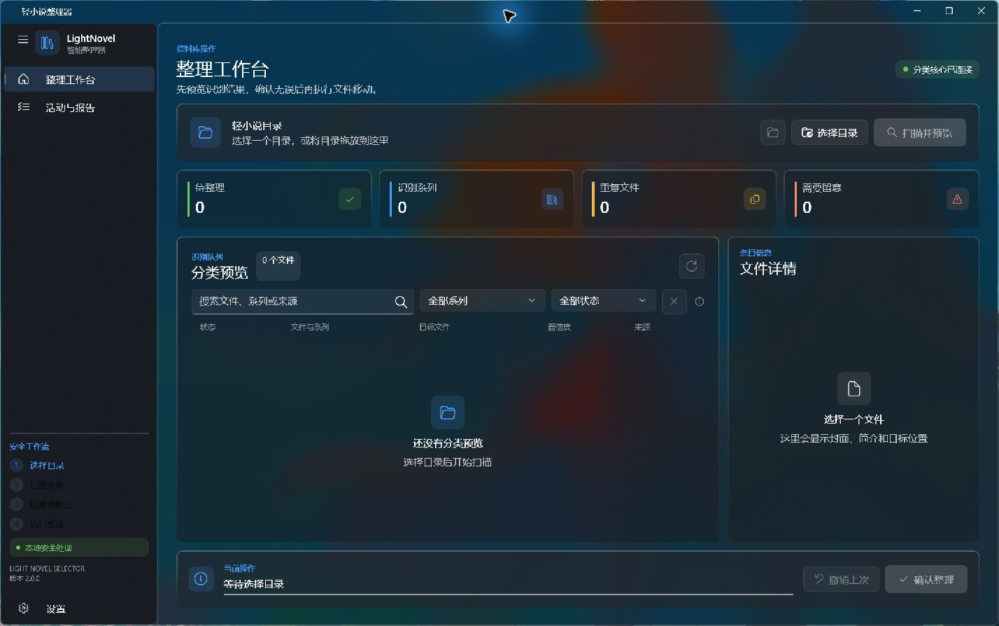
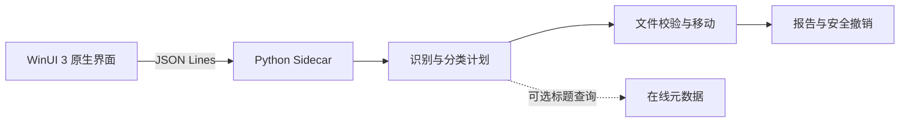

<div align="center">
  
  <h1>LightNovelSelector</h1>
  <p><strong>在移动文件之前，把轻小说分类结果完整地交给你确认。</strong></p>
  <p>面向 Windows 的本地轻小说识别、预览、整理与安全撤销工具。</p>

  <p>
    <a href="https://github.com/chenhaoxiang05/LightNovelSelector/actions/workflows/windows-ci.yml"></a>
    <a href="https://github.com/chenhaoxiang05/LightNovelSelector/actions/workflows/codeql.yml"></a>
    <a href="https://github.com/chenhaoxiang05/LightNovelSelector/releases/latest"></a>
    
    
    
    <a href="LICENSE"></a>
  </p>

  <p>
    <a href="#快速开始"><strong>快速开始</strong></a> ·
    <a href="https://github.com/chenhaoxiang05/LightNovelSelector/releases">下载发布版</a> ·
    <a href="CHANGELOG.md">更新记录</a> ·
    <a href="docs/WINUI_ARCHITECTURE.md">架构说明</a> ·
    <a href="CONTRIBUTING.md">参与贡献</a> ·
    <a href="https://github.com/chenhaoxiang05/LightNovelSelector/issues">问题反馈</a>
  </p>
</div>

<picture>
  <source media="(prefers-color-scheme: dark)" srcset="docs/interface-winui-dark.png">
  
</picture>

> [!TIP]
> 最新稳定版是 **WinUI 3 原生版 `v2.0.2`**。可直接下载 [Windows x64 安装器](https://github.com/chenhaoxiang05/LightNovelSelector/releases/download/v2.0.2/LightNovelSelector-v2.0.2-win-x64-setup.exe)，不需要另装 Python、.NET 或 Windows App SDK。

## 为什么使用它

- **先预览，再整理**：扫描阶段只读取文件并生成分类计划，确认前不会移动原文件。
- **识别结果可解释**：统一显示书名、系列、作者、卷号、语言、标签、识别来源和置信度，并允许手动修正。
- **批量操作仍可控**：支持搜索、系列筛选、状态筛选、重复标记和错误隔离。
- **文件安全优先**：完整 SHA-256 指纹确认重复内容，目标冲突不会覆盖现有文件。
- **失败也能恢复**：每次移动前都会把恢复意图刷盘，批处理中断后可重建报告并撤销已完成项。
- **本地优先**：小说文件、哈希和报告保留在本机；联网识别可随时关闭。

## 快速开始

### 下载发布版

从 [`v2.0.2` 发布页](https://github.com/chenhaoxiang05/LightNovelSelector/releases/tag/v2.0.2) 下载：

```text
LightNovelSelector-v2.0.2-win-x64-setup.exe
```

安装器按当前 Windows 用户安装，不要求管理员权限，并包含 .NET、Windows App SDK 与 Python Sidecar。发布产物暂未进行商业代码签名，请只从本仓库 Release 下载并核对发布页提供的 SHA-256。

下载后可在 PowerShell 中计算校验值，并与 Release 页面逐字比对：

```powershell
Get-FileHash .\LightNovelSelector-v2.0.2-win-x64-setup.exe -Algorithm SHA256
```

### 从源码运行 WinUI 3 版本

开发环境需要 Windows 10 1809 或更高版本、Python 3.10+ 与 .NET 10 SDK：

```powershell
git clone https://github.com/chenhaoxiang05/LightNovelSelector.git
cd LightNovelSelector
.\run_winui.bat
```

首次启动会自动准备 Python 环境。`run.bat` 与 `run_winui.bat` 均进入同一个 WinUI 3 界面。

## 三步完成整理

1. **选择目录**：选择存放待整理小说的目录，或拖入一个目录及同目录中的一批文件。
2. **扫描并预览**：检查系列、置信度、目标路径、重复项和异常项，必要时手动修正。
3. **确认整理**：核对完整执行范围后移动文件；随后可在“活动与报告”中查看或撤销。

常用快捷键：

| 快捷键 | 操作 |
| --- | --- |
| `Ctrl+O` | 选择目录 |
| `F5` | 扫描并预览 |
| `Ctrl+Enter` | 打开整理确认对话框 |

<details>
<summary><strong>查看深色与浅色界面</strong></summary>

| 跟随 Windows 浅色 | 跟随 Windows 深色 |
| :---: | :---: |
|  |  |

</details>

## 原生桌面架构

桌面界面采用 **WinUI 3 + Windows App SDK**，分类与文件安全逻辑由 Python 负责。两端通过本机标准输入输出上的 JSON Lines 协议通信，不启动本地网页服务器。



旧 WebView 界面已经停用并从当前源码移除，最后一个完整版本保存在 Git 标签 [`legacy-webview-final`](https://github.com/chenhaoxiang05/LightNovelSelector/tree/legacy-webview-final)。详细职责边界见 [WinUI 架构说明](docs/WINUI_ARCHITECTURE.md) 和 [项目结构说明](docs/PROJECT_STRUCTURE.md)。

## 文件安全

LightNovelSelector 将“能恢复”视为批量整理的基本要求：

- 扫描只生成预览，不移动文件。
- 搜索与筛选只改变当前显示，不会悄悄缩小执行范围。
- 设置或目录变化后，旧预览自动失效。
- 重复检测比较完整文件内容，不依赖容易碰撞的头尾片段。
- 执行前再次验证源文件、目标路径和报告写入能力。
- 扫描后源文件发生大小或修改时间变化时拒绝执行，并提示重新扫描。
- 从查找目录项开始即可随时取消；单次最多检查 200,000 个目录项、处理 10,000 个受支持文件，超出时会提示缩小范围。
- 主程序只保留一个活动实例，重复启动会唤回已有窗口，避免并发操作同一目录。
- 目标存在同名文件时不会覆盖，重复项与错误项默认跳过。
- 批量整理使用线性恢复日志，部分移动成功、进程异常退出或后续步骤失败时仍可重建已完成记录。
- 恢复时会同时核对原计划、源和目标位置及文件状态；状态有歧义时停止并要求人工检查。
- 撤销会把每项严格判定为“待撤销”或“已恢复”；源和目标同时存在、同时缺失或文件状态不匹配时整批停止。
- 分类后的目标文件若已被编辑、替换为目录或符号链接，撤销会停止并保留现状。
- 撤销前会校验报告版本、应用标识、所在目录和全部文件路径，拒绝执行超出所选目录的记录。

分类报告默认保存在：

```text
所选目录\classification_report.json
```

整理进行中或异常退出后，同目录可能短暂保留
`classification_report.recovery.jsonl`。它只用于核对尚未汇总的移动记录，成功完成或恢复后会自动删除。请勿修改、移动或单独删除报告与恢复日志；两者都包含绝对路径，也不要公开上传。

## 识别能力

识别顺序综合自定义规则、文件名、本地 EPUB 元数据与内容提示，以及可选的 Bangumi、AniList、Jikan 在线条目。内部使用统一书籍身份记录书名、系列、作者、卷号、语言和标签；字段没有足够证据时会显示“未识别”，不会为了填满详情而强行猜测。

在线识别仅向这些服务发送从文件名、用户规则或手动修正得到的标题/系列查询；从 EPUB 或弱文件名小说正文中读取的作者、语言、标签和内容提示始终留在本机，不会加入联网查询。应用不上传小说文件、完整哈希或分类报告；远程 JSON 和封面只允许公开 HTTPS 地址，并设有体积上限，同时拒绝解析到本机或内部网络的域名。关闭联网后仍可使用全部本地整理能力。

支持格式：

```text
TXT  EPUB  PDF  MOBI  AZW  AZW3  FB2  DOC  DOCX  RTF
MD   HTML  CBZ  CBR   ZIP  RAR   7Z
```

EPUB、ZIP 和 CBZ 可读取本地封面与部分内容提示；其他格式仍可通过文件名、自定义规则和可选在线元数据识别。

## 命令行与构建

Python CLI 保留给自动化与排错：

```powershell
py .\lightnovel_classifier.py "D:\你的轻小说目录" --dry-run
py .\lightnovel_classifier.py "D:\你的轻小说目录" --dry-run --no-network --recursive
py .\lightnovel_classifier.py --undo-report "D:\你的轻小说目录\classification_report.json"
```

构建单 EXE 安装器还需要 Inno Setup 6 或更高版本：

```powershell
winget install JRSoftware.InnoSetup
.\build_winui.bat
```

完整开发环境、测试命令和发布流程见 [DEVELOPMENT.md](DEVELOPMENT.md)。

## 获取帮助

- 使用问题或异常：选择 [Bug 报告](https://github.com/chenhaoxiang05/LightNovelSelector/issues/new?template=bug_report.yml)。
- 功能想法：选择 [功能建议](https://github.com/chenhaoxiang05/LightNovelSelector/issues/new?template=feature_request.yml)。
- 安全问题：不要公开附带真实目录、小说内容或敏感日志，请按 [安全说明](SECURITY.md) 私下报告。
- 参与开发：阅读 [贡献指南](CONTRIBUTING.md) 和 [行为准则](CODE_OF_CONDUCT.md)。

## 开源许可证

LightNovelSelector 采用 [MIT License](LICENSE)。你可以使用、修改、分发、再许可或销售本软件，也欢迎提交改进；分发源码或软件副本时需保留原版权声明和许可证文本。正式安装器同时附带 [第三方组件说明](THIRD_PARTY_NOTICES.md) 及各运行时的原始许可证全文。
