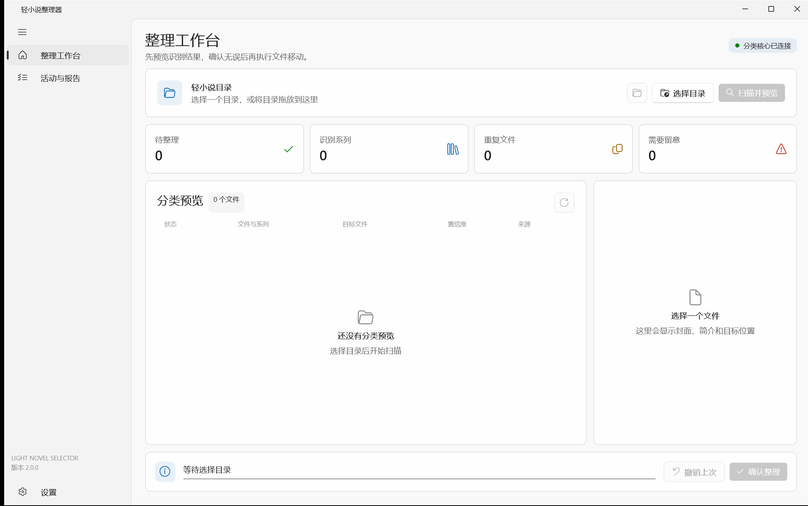
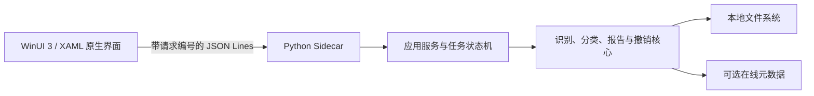

# LightNovelSelector 轻小说自动整理工具

LightNovelSelector 是一款面向 Windows 的本地桌面工具，用来批量识别、预览和整理轻小说文件。它会结合文件名、电子书内容提示、自定义规则和可选在线条目识别作品系列，并在用户确认后把文件移动到对应系列目录。

当前版本：`v2.0.0`

> 当前开发分支提供 WinUI 3 原生界面预览，尚未合并到稳定分支。



## 主要能力

- 批量扫描 `.txt`、`.epub`、`.pdf`、`.mobi`、`.azw3`、`.docx`、`.zip`、`.cbz` 等小说文件。
- 自动提取小说标题、卷号、系列名、识别来源和分类置信度。
- 支持 Bangumi、AniList、Jikan 在线识别，本地规则始终作为兜底。
- 扫描阶段只生成预览，不修改原文件。
- 支持手动修正分类结果和自定义通配符规则。
- 使用完整 SHA-256 内容哈希确认重复文件。
- 执行过程中持续写入报告，部分失败仍可撤销已完成移动。
- 支持按 `classification_report.json` 撤销上次分类。
- 已位于正确目录的文件会标记为“无需移动”，重复扫描不会生成多余副本。
- 保留命令行模式和 WebView 兼容界面。

## 原生界面架构

WinUI 3 负责窗口、布局、主题、动画和 Windows 原生交互，Python 继续负责所有识别和文件操作。两个进程通过标准输入输出上的 JSON Lines 协议通信：



这种结构带来的效果：

- 使用原生 Mica 窗口背景、Acrylic 临时浮层、Windows 字体与控件行为。
- 原生标题栏、目录选择器、拖放、导航、对话框、Toast 和高 DPI 适配。
- 列表由 WinUI 虚拟化，不把大量文件行一次性渲染到界面。
- 扫描和文件移动在 Python 后台任务中运行，界面持续响应。
- Python 进程异常退出时，界面会显示明确诊断；关闭界面时会回收子进程。
- 发布包内置 Python Sidecar、.NET 和 Windows App SDK 运行组件，下载者不需要安装开发环境。

## 界面与交互

- 左侧导航包含整理工作台、活动与报告、设置。
- 主工作区包含拖放导入、统计卡片、分类表格、详情面板和底部安全操作栏。
- 状态同时使用图标、文字和语义颜色表达，不只依赖颜色。
- 复选框选中显示对勾，不使用容易与错误状态混淆的叉号。
- 扫描、执行和撤销期间会禁用冲突操作，并显示真实任务进度。
- 执行分类和撤销前都需要确认，文件移动期间阻止误关窗口。
- 支持系统、浅色、深色主题以及 Windows 高对比度模式。
- 窄窗口会自动收起侧栏并隐藏常驻详情栏，详情仍可通过对话框查看。

动效只服务状态与空间关系：

- 按钮按压使用 110 至 180 毫秒缩放反馈。
- 卡片进入使用强 `ease-out` 和短距离位移，最长 280 毫秒。
- Toast 进入 220 毫秒、退出 140 毫秒，退出比进入更快。
- 高频选择、筛选和键盘操作不增加等待动画。
- 自动遵循 Windows“动画效果”设置，也可在设置页单独减少动态效果。

## 快速开始

### 使用 WinUI 便携版

下载并解压 Windows x64 ZIP，然后运行：

```text
LightNovelSelector.WinUI.exe
```

ZIP 是自包含发布包。普通下载者不需要安装 Python、.NET SDK 或 Windows App SDK Runtime，也不需要管理员权限。

### 从源码启动 WinUI

开发机需要 Windows 10 1809 或更高版本、Python 3.10+ 和 .NET 10 SDK。双击：

```text
run_winui.bat
```

脚本会查找当前有效的 Python，设置 Sidecar 路径，还原 NuGet 包并启动 WinUI 3 调试版本。系统重装后不会继续引用已经失效的旧 Python 路径。

### 使用兼容界面

双击 `run.bat` 可继续启动 pywebview + WebView2 兼容界面。命令行入口 `lightnovel_classifier.py` 保持不变。

## 使用流程

1. 点击“选择目录”，或把目录和同目录中的一批小说拖入导入区。
2. 在设置页决定是否联网、是否递归扫描、是否自动重命名，并维护自定义规则。
3. 点击“扫描并预览”。
4. 检查状态、目标系列、置信度、识别来源和详情。
5. 识别不准确时，选中条目并手动修正系列名。
6. 点击“确认整理”，核对将移动、将跳过和涉及系列数量。
7. 整理完成后在“活动与报告”查看结果和日志。
8. 需要恢复时点击“撤销上次”。

默认只扫描所选目录第一层。开启“包含子文件夹”后会递归扫描。

## 文件安全

LightNovelSelector 按“先预览、再执行、可撤销”工作：

- 扫描不会移动文件。
- 目录或设置变化后，旧预览自动失效。
- 重复文件先筛选候选，再使用完整 SHA-256 确认。
- 重复项和错误项默认跳过，不会自动删除。
- 执行前先验证报告可写；不可写时不会开始移动。
- 每移动成功一个文件都会原子更新实际目标记录。
- 后续文件失败时，已完成部分仍可按报告撤销。
- 在线封面限制为 8 MiB，并验证实际图片格式。
- 设置保存采用尽力而为策略，偏好写入失败不会阻断扫描。

分类报告默认保存到：

```text
所选目录\classification_report.json
```

## 自定义规则

每条规则由“文件匹配模式”和“目标系列”组成，命中后优先于自动识别。例如：

```text
*SAO* -> Sword Art Online
*无职转生* -> 无职转生
```

设置保存位置：

```text
%LOCALAPPDATA%\LightNovelSelector\settings.json
```

## 命令行模式

只预览，不移动文件：

```powershell
py .\lightnovel_classifier.py "D:\你的轻小说目录" --dry-run
```

关闭联网识别并包含子文件夹：

```powershell
py .\lightnovel_classifier.py "D:\你的轻小说目录" --dry-run --no-network --recursive
```

按报告撤销：

```powershell
py .\lightnovel_classifier.py --undo-report "D:\你的轻小说目录\classification_report.json"
```

## 支持格式

```text
.txt .epub .pdf .mobi .azw .azw3 .fb2 .doc .docx .rtf
.md .html .htm .cbz .cbr .zip .rar .7z
```

EPUB、ZIP 和 CBZ 支持读取本地封面与部分内容提示。其他格式仍可通过文件名识别和分类。

## 隐私说明

- 文件内容、哈希、设置和分类报告保存在本机。
- 关闭联网识别后，不会调用在线元数据服务。
- 开启联网识别时，只发送用于检索的标题或系列查询，不上传小说文件。
- 软件不会自动删除重复文件，只会标记并跳过。

## 项目结构

```text
lightnovel_classifier.py          Python 兼容入口与 CLI
lightnovel_sidecar.py             便携包 Sidecar 入口
lightnovel_selector/
  application.py                 应用服务、任务状态与 UI 数据
  classification.py              扫描计划、移动、报告、撤销
  files.py                       文件读取、封面、哈希与重复检测
  metadata.py                    在线元数据解析
  parsing.py                     文件名、标题和卷号解析
  sidecar.py                     JSON Lines 进程协议
  storage.py                     设置、缓存和原子 JSON 存储
  web/                           WebView 兼容界面资源
native/LightNovelSelector.WinUI/  WinUI 3 原生界面
tests/                            Python 核心与 Sidecar 测试
tools/generate_native_assets.py  原生图标资源生成器
```

维护者请阅读 [开发说明](DEVELOPMENT.md) 和 [WinUI 架构说明](docs/WINUI_ARCHITECTURE.md)。本次更新内容见 [更新说明](UPDATE_NOTES.md)。
