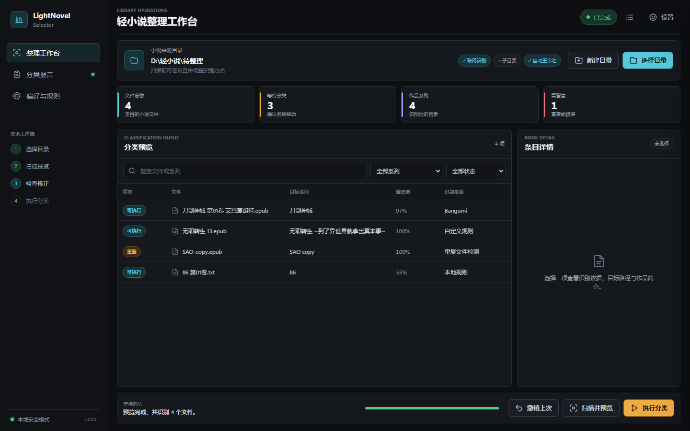

# LightNovelSelector 轻小说自动整理工具

LightNovelSelector 是一款面向 Windows 的本地桌面工具，用来批量识别、预览和整理轻小说文件。它会根据文件名、电子书内容提示、自定义规则和在线条目识别作品系列，并在用户确认后把文件移动到对应系列目录。

当前版本：`v2.0.0`



## 主要能力

- 批量扫描 `.txt`、`.epub`、`.pdf`、`.mobi`、`.azw3`、`.docx`、`.zip`、`.cbz` 等小说文件。
- 自动提取小说标题、卷号和系列名。
- 支持 Bangumi、AniList、Jikan 在线识别，本地规则始终作为兜底。
- 扫描阶段只生成预览，不修改原文件。
- 显示识别来源、置信度、目标目录、条目简介和封面。
- 支持手动修正分类结果和自定义匹配规则。
- 使用完整 SHA-256 内容哈希确认重复文件。
- 执行前验证报告可写，移动过程中持续写入可撤销报告。
- 支持按 `classification_report.json` 撤销上次分类。
- 已位于正确目录的文件会标记为“无需移动”，重复扫描不会生成 `(1)` 副本。
- 保留完整命令行模式，适合脚本或批量任务。

## v2.0 重构

v2.0 保留了原有分类与文件安全逻辑，并把单体程序拆成清晰的四层结构：


- 所有文件扫描、哈希、移动、报告和撤销仍由 Python 执行。
- 界面只能调用明确开放的 Python 方法，不能直接访问文件系统。
- WebView 界面使用 Windows WebView2 渲染，不依赖 Electron 或本地 Web 服务器。
- 原入口 `lightnovel_classifier.py` 和原有 CLI 参数保持兼容。

## 界面与交互

- 中性石墨工作台，青色用于识别，琥珀用于执行，绿色用于成功，红色用于错误。
- 左侧显示安全工作流，主区域包含目录、统计、分类队列、详情和底部操作栏。
- 分类队列支持按文件名、系列和状态筛选。
- 选中条目可查看识别依据、目标路径、简介、封面和外部条目链接。
- 设置页使用明确开关和对勾反馈，不使用容易与错误状态混淆的叉号。
- 扫描、执行和撤销期间会锁定冲突操作。
- 执行分类前显示将移动、将跳过和作品系列数量。
- Toast、弹窗、抽屉和进度反馈使用 130 至 240 毫秒的非线性过渡。
- 高频表格选择、筛选和键盘快捷键保持即时响应，不堆叠动画。
- 自动尊重 Windows 的“减少动态效果”辅助功能设置。

快捷键：

| 快捷键 | 功能 |
| --- | --- |
| `Ctrl+O` | 选择整理目录 |
| `F5` | 扫描并预览 |
| `Ctrl+Enter` | 打开执行确认 |
| `Ctrl+R` | 查看最近分类报告 |
| `Ctrl+Z` | 打开撤销确认 |

## 快速开始

### 使用打包版

从 GitHub Releases 下载最新的 Windows 单文件程序：

```text
LightNovelSelector-v2.0.0-构建时间.exe
```

双击运行即可，不需要另外安装 Python。系统需要 Microsoft Edge WebView2 Runtime，Windows 10/11 通常已经具备。

### 使用源码

在项目目录双击 `run.bat`，或在 PowerShell 中运行：

```powershell
.\run.bat
```

第一次运行时，脚本会：

1. 查找当前可用的 Python 3.10 或更高版本。
2. 在项目目录创建独立的 `.venv`。
3. 安装固定版本的桌面界面依赖。
4. 启动 LightNovelSelector。

旧虚拟环境因重装系统失效时，脚本会把它移入 `archive_old_code`，再使用当前 Python 重建。

## 使用流程

1. 点击“选择目录”，选择存放待整理轻小说的大文件夹。
2. 在“偏好与规则”中决定是否联网、包含子目录和自动重命名。
3. 点击“扫描并预览”。
4. 检查文件状态、目标系列和置信度。
5. 识别不准确时，选择条目后点击“修正分类”。
6. 点击“执行分类”，确认本次移动数量。
7. 分类完成后查看 `classification_report.json`。
8. 需要恢复时点击“撤销上次”。

默认只扫描所选目录的第一层。开启“包含子文件夹”后会递归扫描。

## 文件安全

LightNovelSelector 按“先预览、再执行、可撤销”工作：

- 扫描不会移动文件。
- 目录或设置变化后，旧预览自动失效。
- 重复文件使用快速签名筛选候选，再使用完整 SHA-256 确认。
- 重复项和错误项默认跳过。
- 报告采用原子写入，避免只写出半个 JSON 文件。
- 执行前先写入 0 进度报告，报告不可写时不会开始移动。
- 每移动成功一个文件都会更新实际目标记录。
- 后续文件移动失败时，已完成部分仍可根据报告撤销。
- 移动或撤销期间禁止关闭窗口，防止文件状态与报告不一致。
- 在线封面限制为 8 MiB，并验证实际图片格式。

分类报告默认保存到：

```text
所选目录\classification_report.json
```

## 自定义规则

设置页支持通配符规则。每条规则由“文件匹配模式”和“目标系列”组成，命中后优先于自动识别。

示例：

```text
*SAO* -> Sword Art Online
*无职转生* -> 无职转生
```

设置保存位置：

```text
%LOCALAPPDATA%\LightNovelSelector\settings.json
```

设置写入失败不会阻断扫描，本次运行仍可继续使用内存中的设置。

## 命令行模式

只预览，不移动文件：

```powershell
py .\lightnovel_classifier.py "D:\你的轻小说目录" --dry-run
```

关闭联网识别：

```powershell
py .\lightnovel_classifier.py "D:\你的轻小说目录" --dry-run --no-network
```

包含子文件夹：

```powershell
py .\lightnovel_classifier.py "D:\你的轻小说目录" --dry-run --recursive
```

启用自动重命名：

```powershell
py .\lightnovel_classifier.py "D:\你的轻小说目录" --dry-run --auto-rename
```

按报告撤销：

```powershell
py .\lightnovel_classifier.py --undo-report "D:\你的轻小说目录\classification_report.json"
```

减少命令行输出：

```powershell
py .\lightnovel_classifier.py "D:\你的轻小说目录" --quiet
```

## 支持格式

```text
.txt .epub .pdf .mobi .azw .azw3 .fb2 .doc .docx .rtf
.md .html .htm .cbz .cbr .zip .rar .7z
```

EPUB、ZIP 和 CBZ 支持读取本地封面与部分内容提示。其他格式仍可通过文件名识别和分类。

## 隐私说明

- 文件内容、哈希和分类报告保存在本机。
- 关闭联网识别后，不会调用在线元数据服务。
- 开启联网识别时，只发送用于检索的标题或系列查询，不上传小说文件。
- 软件不会自动删除重复文件，只会标记并跳过。

## 项目结构

```text
lightnovel_classifier.py          兼容入口
lightnovel_selector/
  application.py                 应用服务、任务状态与 UI 数据
  classification.py              扫描计划、移动、报告、撤销
  constants.py                   版本和常量
  desktop.py                     pywebview 桌面桥接
  files.py                       文件读取、封面、哈希与重复检测
  metadata.py                    在线元数据解析
  models.py                      不可变数据模型
  parsing.py                     文件名、标题和卷号解析
  storage.py                     设置、缓存和原子 JSON 存储
  web/                           桌面界面资源
tests/                            核心与应用服务测试
```

## 开发与打包

维护者请阅读 [DEVELOPMENT.md](DEVELOPMENT.md)。v2.0 更新内容见 [UPDATE_NOTES.md](UPDATE_NOTES.md)。

