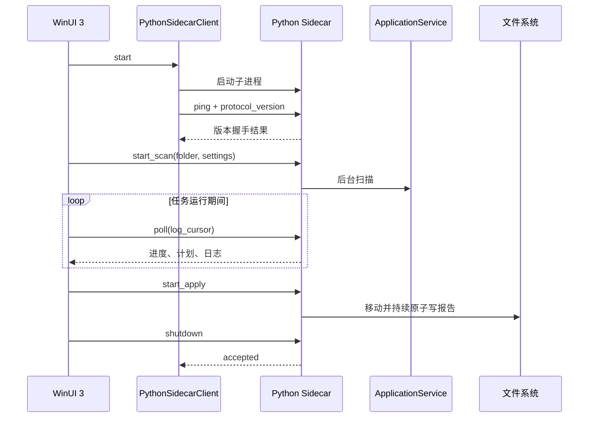

# WinUI 3 与 Python 架构说明

## 设计目标

LightNovelSelector 需要同时满足两件事：界面拥有真正的 Windows 原生质感，文件识别与整理逻辑继续使用成熟的 Python 实现。项目采用独立进程边界，而不是把 Python 解释器直接嵌入 C# 进程。



## 为什么采用 Sidecar

- Python 核心可以继续独立测试和命令行运行。
- C# 与 Python 崩溃边界清晰，错误可以转成结构化界面反馈。
- 不需要 Python.NET、COM 或进程内 GIL 管理。
- 发布时可把 Python 核心冻结成独立 EXE，用户无需安装 Python。
- 文件权限只掌握在 Python 核心，界面层无法绕过分类安全规则。

代价是需要维护一份稳定协议，并承担一次本地进程通信开销。对于扫描和文件移动任务，这部分开销远小于磁盘、哈希和网络查询耗时。

## 协议格式

传输编码为 UTF-8，每行一个完整 JSON 对象。

请求：

```json
{"id": 12, "method": "start_scan", "params": {"folder": "D:\\Books"}}
```

成功响应：

```json
{"id": 12, "result": {"accepted": true}}
```

失败响应：

```json
{"id": 12, "error": {"type": "ValueError", "message": "目录不存在"}}
```

约束：

- `id` 是正整数，同一连接内唯一。
- `method` 必须位于 Sidecar 白名单。
- 未识别方法、非法参数和 Python 异常都转换为错误对象。
- 协议内容只写标准输出；标准错误保留最近诊断。
- C# 使用并发字典按 `id` 完成等待中的任务。
- 普通请求和启动握手都有超时，进程退出会使所有等待请求失败。

当前方法：

| 方法 | 作用 |
| --- | --- |
| `ping` | 返回应用版本和协议版本 |
| `bootstrap` | 获取设置、报告、任务和初始快照 |
| `poll` | 增量获取进度、计划、详情状态和日志 |
| `set_folder` | 更新当前目录并使旧预览失效 |
| `save_settings` | 保存偏好和自定义规则 |
| `start_scan` | 启动后台扫描 |
| `cancel` | 请求取消当前可取消任务 |
| `edit_plan` | 手动修正单条分类计划 |
| `get_detail` | 获取封面、简介和目标详情 |
| `start_apply` | 启动文件整理 |
| `start_undo` | 按最近报告启动撤销 |
| `get_report` | 读取最近报告摘要 |
| `shutdown` | 优雅停止 Sidecar |

## 生命周期

1. WinUI 启动时优先查找应用目录中的 `LightNovelSelector.Sidecar.exe`。
2. 开发模式下向上查找仓库根目录，并按环境变量、`.venv-build`、`.venv`、系统 Python 顺序选择解释器。
3. Sidecar 启动后立即执行 `ping`，确认协议版本。
4. WinUI 定时 `poll`，但使用互斥标记避免轮询重入。
5. 页面卸载时停止计时器、取消详情和 Toast，并释放 Sidecar 客户端。
6. 正常退出先发送 `shutdown`；超时或管道损坏时终止整个进程树。
7. 文件移动或撤销运行中，窗口关闭事件会被取消并显示警告。

## UI 状态边界

Python 返回不可变快照，WinUI 只把快照映射为视觉状态：

- 任务状态决定按钮启用、取消入口、进度和关闭保护。
- 计划修订号变化时才重建列表，普通轮询不抖动选择状态。
- 日志使用递增游标去重，不重复追加同一记录。
- 详情请求使用取消令牌，快速切换选择不会让旧响应覆盖新选择。
- 目录或设置变化会使计划版本失效，执行前由 Python 再次验证。

## 动效边界

动效由 `Helpers/Motion.cs` 统一实现：

- 进入、Toast、按压和统计反馈使用 Windows Composition。
- 动画属性限制为 `Opacity`、`Scale` 和 `Translation`。
- 强 ease-out 曲线为 `(0.22, 1, 0.36, 1)`。
- 进入和退出方向一致，退出时长更短。
- `UISettings.AnimationsEnabled` 关闭时自动降级。
- 应用内 `ReducedMotion` 只保留必要的状态切换。

## 发布边界

`build_winui.bat` 生成两部分再合并：

1. PyInstaller 将 `lightnovel_sidecar.py` 冻结为单文件 Sidecar。
2. `dotnet publish` 以 `win-x64` 自包含方式发布 WinUI。
3. 项目文件把生成的 Sidecar 作为发布内容复制到 WinUI 目录根部。
4. 发布目录执行真实启动冒烟，再压缩为 ZIP。

自包含包体积较大，但不依赖目标机器已有 Python、.NET 或 Windows App SDK。`PublishTrimmed` 保持关闭，避免 XAML 和 JSON 反射元数据被错误裁剪；`PublishReadyToRun` 关闭，避免额外运行时包要求并控制体积。

## 故障定位

界面显示“分类核心不可用”时，按顺序检查：

1. 发布目录是否同时存在主程序和 Sidecar。
2. `ping` 是否返回 `protocol_version = 1`。
3. Sidecar 标准错误中的最近诊断。
4. 开发模式的 `LN_SELECTOR_PYTHON` 是否指向有效解释器。
5. 设置目录和目标目录是否可读写。

可单独验证冻结 Sidecar：

```powershell
'{"id":1,"method":"ping"}', '{"id":2,"method":"shutdown"}' |
  .\build\native-sidecar\LightNovelSelector.Sidecar.exe
```

任何协议格式变更都必须同步更新 Python 测试、C# 模型和 `SupportedProtocolVersion`。不兼容变更应提升协议版本，不能静默复用旧版本。
