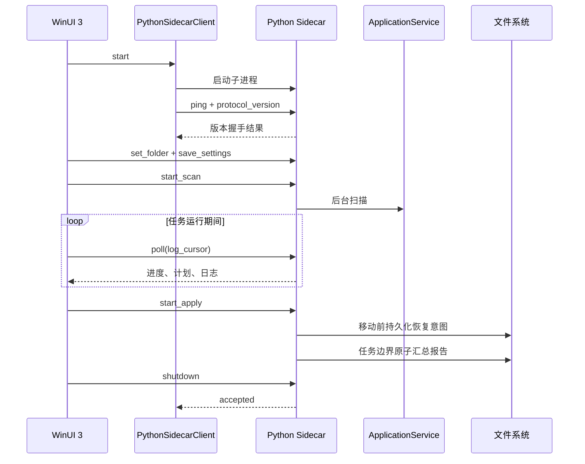

# WinUI 3 与 Python 架构说明

## 设计目标

LightNovelSelector 需要同时满足两件事：界面拥有真正的 Windows 原生质感，文件识别与整理逻辑继续使用成熟的 Python 实现。项目采用独立进程边界，而不是把 Python 解释器直接嵌入 C# 进程。



## 为什么采用 Sidecar

- Python 核心可以继续独立测试和命令行运行。
- C# 与 Python 崩溃边界清晰，错误可以转成结构化界面反馈。
- 不需要 Python.NET、COM 或进程内 GIL 管理。
- 发布时可把 Python 核心冻结成独立 EXE，用户无需安装 Python。
- 文件权限只掌握在 Python 核心，界面层无法绕过分类安全规则。

代价是需要维护一份稳定协议，并承担一次本地进程通信开销。对于扫描和文件移动任务，这部分开销远小于磁盘、哈希和网络查询耗时。

## 协议格式

传输编码为 UTF-8，每行一个完整 JSON 对象。

请求：

```json
{"id":12,"method":"set_folder","params":{"path":"D:\\Books"}}
```

成功响应：

```json
{"id":12,"ok":true,"result":{"folder":"D:\\Books"}}
```

失败响应：

```json
{"id":12,"ok":false,"error":{"type":"ValueError","message":"目录不存在"}}
```

约束：

- `id` 是正整数，同一连接内唯一。
- `method` 必须位于 Sidecar 白名单。
- 未识别方法、非法参数和 Python 异常都转换为错误对象。
- 单条请求上限为 1 MiB，超限行会被丢弃，后续合法请求仍可继续。
- 协议内容只写标准输出；标准错误保留最近诊断。
- C# 使用并发字典按 `id` 完成等待中的任务。
- 普通请求和启动握手都有超时，进程退出会使所有等待请求失败。

当前方法：

| 方法 | 作用 |
| --- | --- |
| `ping` | 返回应用版本和协议版本 |
| `bootstrap` | 获取设置、报告、任务和初始快照 |
| `poll` | 增量获取进度、计划、详情状态和日志 |
| `set_folder` | 更新当前目录并使旧预览失效 |
| `save_settings` | 保存偏好和自定义规则 |
| `start_scan` | 启动后台扫描 |
| `cancel_operation` | 请求取消当前可取消任务 |
| `edit_plan` | 兼容旧客户端的单条分类计划修正 |
| `edit_plans` | 按固定范围原子修正单条或同系列计划 |
| `get_detail` | 获取封面、简介、候选和目标详情 |
| `load_candidates` | 按需查询并合并更多在线候选 |
| `start_apply` | 启动文件整理 |
| `start_undo` | 按最近报告或受校验的执行编号启动撤销 |
| `get_report` | 读取最近报告或指定历史批次摘要 |
| `get_report_history` | 返回有数量上限的分类历史摘要 |
| `shutdown` | 优雅停止 Sidecar |

## 统一书籍身份

Python 核心使用不可变 `BookIdentity` 作为识别结果的唯一语义模型，字段固定为：

- `title`：当前书籍或卷册标题；
- `series_name`：用于分类目录和系列筛选的规范名称；
- `authors`：有序、去重且有数量和长度上限的作者列表；
- `volume_number`：已确认的整数卷号，证据不足时为空；
- `language`：规范语言代码，例如 `zh-Hans`、`zh-Hant`、`ja`、`en`；
- `tags`：有序、去重且有数量和长度上限的题材标签。

识别时先建立文件名身份，再合并 EPUB 本地元数据、系列解析结果和卷册详情。文件内明确语言优先于在线条目的原始语言；在线作者和标签与本地字段去重合并。没有可靠证据的字段保持为空，界面显示“未识别”。

各来源返回的原始置信度会进入统一的保守校准标尺，再结合标题一致性、内容提示和元数据证据形成高、中、需复核等级。分类计划同时保存简短原因与证据列表，WinUI 详情区直接展示，报告以可选附加字段保留，不改变移动和撤销语义。

只有用户明确保存的修正才会写入 `%LOCALAPPDATA%\LightNovelSelector\recognition_aliases.json`。字典按规范系列键精确匹配并设有条目和体积上限，只保存别名、确认后的系列名与更新时间；读取或写入失败按空字典降级，不阻断扫描和修正。

元数据缓存写入嵌套 `identity`，同时保留旧版顶层字段；读取时兼容只有 `title` 和 `series_name` 的历史缓存。分类报告 schema 仍为 v2，新增身份对象属于向后兼容字段，旧版撤销逻辑只消费路径和文件状态，不依赖新字段。Sidecar 协议版本保持 1，WinUI 对缺少身份对象的旧载荷使用空列表和空值，不会反序列化失败。

文件正文与 EPUB 元数据只参与本地身份补全。联网请求仍只使用文件名、用户规则或手动系列名称构造的查询，不发送正文、作者列表、标签、完整哈希或报告内容。

## 元数据提供器边界

`MetadataProvider` 是在线书库的唯一公开扩展接口，固定提供系列匹配和可选书籍详情两个入口。`MetadataProviderRegistry` 在启动时验证提供器 ID、显示名、优先级、缓存版本和重复项，并按优先级生成不可变顺序。`SeriesResolver` 只遍历注册表、隔离异常、归一化输出和管理缓存，不包含任何服务 URL 或远程字段映射。

内置 Bangumi、AniList、Jikan 分别位于 `lightnovel_selector/providers/`。扫描、候选比较、详情加载和 `ApplicationService` 共用同一主注册表；用户设置只派生当前启用且按有效优先级排列的不可变注册表，不修改提供器实例。Sidecar 快照以附加字段 `metadata_providers` 返回 ID、名称、启用状态、有效/默认优先级和健康统计，旧客户端可安全忽略，WinUI 设置页据此提供来源控制。Sidecar 协议版本保持 1。

提供器输出进入计划前会重新限制标题、系列、作者、标签、卷号、语言、有限置信度、简介和 HTTPS URL；提供器声明的 `source` 与 `query` 不受信任，核心分别替换为已注册显示名和当前查询。单个提供器抛出的普通异常只记录有界错误、进入独立冷却并继续后续来源；`MemoryError` 不会被吞掉。连续失败使用 30–300 秒有上限指数冷却，成功后重置；来源正常返回 `None` 时才建立 120 秒内存负缓存，异常与取消不会污染负缓存。

元数据缓存键包含按有效优先级排列的 `provider_id@cache_version:priority` 指纹，每条记录同时绑定实际命中的 `provider_id`。读取缓存时会确认来源仍在当前注册表并重新执行输出契约；未知来源、损坏记录或不安全 URL 不会进入分类计划。同一查询在不同启用组合或优先级下不会共享结果；提供器改变远程字段映射或结果语义时必须提升自己的缓存版本。运行时健康状态只保留计数、剩余冷却和有界错误，不持久化查询。

应用不会自动发现用户目录、环境变量或 Python entry point 中的插件，避免未经确认的代码继承文件整理权限。第三方代码必须由调用方显式注入，或作为经过审查的内置模块注册。完整接口示例和测试要求见 [元数据提供器开发指南](METADATA_PROVIDERS.md)。

## 增量扫描与哈希缓存边界

WinUI 发起扫描时，`ApplicationService` 只建立后台线程和界面操作状态，具体扫描由独立 `ScanSession` 执行。会话统一管理取消检查、进度回调和 `PersistentScanCache` 生命周期，但不持有 UI 状态，也不创建线程，因此可以脱离 Sidecar 单独测试。

缓存保存在 `%LOCALAPPDATA%\LightNovelSelector\scan_cache.json`，在任务成功、取消或失败退出上下文时最多原子写入一次。损坏缓存按空缓存处理；写入失败只进入日志和快照中的 `scan_cache.write_warning`，当前分类计划仍然有效。

每个可缓存文件都建立 `FileSnapshot`：

- Windows 卷序列号与 128 位文件 ID，或其他系统的设备号与 inode；
- 文件大小与纳秒级最后写入时间；
- Windows `FILE_BASIC_INFO.ChangeTime`，或其他系统的 `st_ctime_ns`。

只有完整快照一致时才复用字段。Windows ChangeTime 能发现“内容已改写但最后写入时间被恢复”的情况；取不到可靠 ChangeTime 时 `change_token` 为空，该文件的快速签名、完整哈希和本地分析都实时重算。缓存 schema 变化时整体失效，条目按最近使用时间裁剪，并同时受 25,000 条和 32 MiB 上限保护。

快速签名只读取首尾内容并用于候选分组，不能直接产生重复状态。候选组仍比较完整 SHA-256；缓存中的完整哈希也必须通过同一强快照校验。缓存的本地分析只保存派生 `BookIdentity`、查询和是否使用内容提示，不保存正文提示原文；文件名变化时不会复用旧的本地分析。

Python 快照附带 `scan_cache` 统计，包含复用、更新、失效、快速签名、完整哈希、本地分析和不可缓存文件数。WinUI 对该字段使用安全默认值，最终操作消息显示本次复用文件数。该附加字段不改变 Sidecar 协议版本，也不改变筛选、整理或撤销范围。

## 候选与批量修正边界

扫描阶段把当前结果与可区分的本地结果合并为有数量上限的候选列表。WinUI 只有在用户点击“联网查找更多”后才调用 `load_candidates`，Python 依次请求允许的元数据提供器，按规范系列名去重，并保留部分成功结果。候选只缓存在内存计划中，不进入主快照、分类报告或撤销记录，也不改变整理范围。

`get_detail`、`load_candidates` 和 `edit_plans` 都携带 `plans_revision`。扫描、目录或设置变化会替换预览并增加版本；旧详情、慢速联网结果和旧修正请求即使随后返回，也会在 Python 端再次核对版本及源路径后拒绝。候选缓存不改变文件执行语义，因此不会单独增加版本。

批量范围固定为 `single` 或 `same_series`，不接受任意索引列表。`same_series` 使用修改前的规范系列键计算完整分组，在计划副本上重新计算全部目标路径；任一条目已移动、文件不可读或目标计算失败时，原计划不会被部分替换。WinUI 默认不勾选批量范围，并在提交前说明“只更新预览、不立即移动文件”后再次确认。

## 生命周期

1. WinUI 注册单实例键；重复启动把激活请求转交给现有窗口，不创建第二个 Sidecar。
2. WinUI 启动时优先查找应用目录中的 `LightNovelSelector.Sidecar.exe`。
3. 开发模式下向上查找仓库根目录，并按环境变量、`.venv-build`、`.venv`、系统 Python 顺序选择解释器。
4. Sidecar 启动后立即执行 `ping`，确认协议版本。
5. WinUI 定时 `poll`，但使用互斥标记避免轮询重入。
6. 启动、调用途中或两次轮询之间发现进程退出时，界面自动执行一次 `RestartAsync` 和 `bootstrap`。
7. 重启只恢复连接、持久化设置和最近报告；内存预览会明确清空，不自动重跑扫描、整理或撤销。
8. 自动恢复失败后停止轮询并进入 `Disconnected`，由用户通过错误栏手动重新连接，避免无限重启。
9. 页面卸载与启动、重启共用生命周期锁，关闭时不会与新进程创建发生竞态。
10. 正常退出先发送 `shutdown`；超时或管道损坏时终止整个进程树。
11. 文件移动或撤销运行中，窗口关闭事件会被取消并显示警告。

## UI 状态边界

Python 返回不可变快照，WinUI 只把快照映射为视觉状态：

- 任务状态决定按钮启用、取消入口、进度和关闭保护。
- 计划修订号变化时才重建列表，普通轮询不抖动选择状态。
- 预览使用主快照和可见快照分离；搜索输入短防抖后一次性替换可见数据源，执行整理始终作用于 Python 持有的完整计划。
- 日志使用递增游标去重，不重复追加同一记录。
- 详情请求使用取消令牌，快速切换选择不会让旧响应覆盖新选择。
- 目录或设置变化会使计划版本失效，执行前由 Python 再次验证。
- 活动报告使用 `ReportHistoryEntry`、`ReportStats` 和 `ReportItem` 强类型模型，兼容缺少可选字段的旧报告。
- 连接状态固定为 `Connecting`、`Ready`、`Recovering`、`Disconnected`，统一控制徽标、错误栏和危险操作按钮。

## 连接恢复边界

`PythonSidecarClient.RestartAsync` 与启动、释放共用同一个生命周期锁。终止旧进程时先从当前进程引用中原子移除，再结束整个进程树；旧进程的退出监控只有在它仍是当前进程时才能使等待请求失败，因此不会误伤新进程请求。

恢复成功后必须重新 `bootstrap`。界面会清空旧计划、详情、日志游标和筛选结果，并提示重新扫描。分类报告保存在磁盘上，仍可在活动页打开；撤销需要核心恢复为 `Ready` 后才能执行。

## 报告恢复边界

整理开始时，Python 先以独占方式创建同目录的 `<报告名>.recovery.jsonl`，取得该报告的
执行权，再原子写入包含全部计划和唯一执行编号的基线报告。已有恢复日志会阻止新任务覆盖
上次现场。每次实际移动前只向恢复日志追加一条源路径和最终目标路径并 `fsync`；正常完成
时统一写最终报告并删除日志。因此 N 个文件只产生 O(N) 的日志写入和固定两次完整报告写入。

进程被强制结束后，读取报告或执行撤销会尝试合并同一执行编号的恢复日志。恢复必须同时满足：

- 报告、日志和记录路径都属于原分类根目录；
- 日志源路径存在于原报告，实际目标仍位于原计划的目标目录；
- 源文件已不存在，目标仍是未变化的普通文件；
- 同一日志中没有重复源路径或目标路径。

若移动尚未发生，表现为“源仍是普通文件且目标不存在”，该意图会安全忽略。源和目标同时存在、同时缺失、变成符号链接或目录、文件状态不匹配以及任何路径越界都会停止恢复并保留日志，等待人工检查。整理仍在当前进程中运行时，活动页只读取基线报告，不消费正在追加的日志。

撤销使用同一套文件状态校验，但不依赖内存中的预览。整批记录会先完成预检，每项只能处于“待撤销”或“已恢复”状态；随后每次移动前后再次复核。进程中断后重新撤销时，已恢复项计为跳过，其余项继续执行。两边同时存在或同时缺失不会被当成已完成。

## 分类历史边界

根目录中的 `classification_report.json` 继续表示最近报告并兼容旧客户端。当前 schema 报告在任务结束或失败边界尽力原子复制到 `.lightnovel-selector/history`，文件名包含 UTC 时间和 32 位执行编号。历史归档失败只产生警告，不会把已经完成的文件移动改判为失败；主报告始终是恢复依据。

`get_report_history` 最多检查 1,000 个目录项并向界面返回最近 100 个有效批次。根报告与归档具有相同执行编号时只显示一条，并优先使用根报告。损坏、过大、非普通文件、链接以及不属于声明根目录的报告计为无效并跳过。

WinUI 只把列表返回的执行编号传给 `get_report` 和 `start_undo`，不向 Python 传任意文件路径。Python 将执行编号解析为根报告或历史目录中的精确文件；C# 在打开或导出前再次限制到标准根报告或历史文件名，并拒绝重解析点。选择历史批次只改变查看与撤销目标，不会改变当前分类计划或自动重跑任何文件操作。

撤销完成后，所选报告会原子写入 `undo_completed_at` 与统计。若撤销的是根报告，其历史副本同步更新；活动页据此禁用重复撤销。实际执行前仍会重新检查全部源、目标和文件状态，历史中的“可撤销”仅表示报告记录过移动，不代表磁盘状态被提前假定为安全。

## 窗口材质边界

- `MainWindow` 只创建一个窗口级系统背景，可在 Desktop Acrylic、Mica 和实色之间切换。
- `WindowAppearanceController` 是唯一允许替换 `SystemBackdrop` 的模块；页面和主题事件不能直接操作窗口背景。
- 主题变化只合并刷新标题栏颜色，系统背景会自行跟随主题，不在 `ActualThemeChanged` 回调中销毁重建。
- 导航栏与 Toast 可使用 In-App Acrylic；列表和重复卡片只使用半透明实色，不逐卡创建模糊层。
- 重复调用相同材质是幂等操作，避免 Windows App SDK 在主题资源解析期间重入原生背景生命周期。
- `UISettings.AdvancedEffectsEnabled` 关闭或高对比度启用时，有效材质临时切换为实色，但不覆盖用户选择。
- 系统事件不可订阅的未打包环境使用低频状态复核，避免影响窗口启动。
- 主题、材质和减少动态效果由 `AppearancePreferences` 统一读取，并使用 `%LOCALAPPDATA%` JSON 后备存储。

## 无障碍与键盘边界

- 页面标题与分区标题分别暴露 UI Automation `Level1` 和 `Level2` 标题层级；主导航、三个内容页面和结果筛选暴露对应地标。
- 关键按钮、输入框、筛选器、列表和状态反馈使用显式中文名称。结果行、候选、历史、报告与日志另外提供由结构化字段生成的朗读摘要。
- `Tab` 顺序遵循 XAML 中从页面标题、主要内容到安全操作栏的视觉顺序；列表仍可获得焦点，便于键盘滚动和辅助技术浏览。
- `F6` 与 `Shift+F6` 通过纯逻辑 `FocusCycleController` 在导航、导入、结果、详情、操作或当前页面对应区域间循环，隐藏及禁用目标会自动跳过。
- `Ctrl+1/2/3`、`Ctrl+F`、`Ctrl+O`、`F5`、`Ctrl+Enter` 和 `Ctrl+S` 同时具有实际处理器与 `AcceleratorKey` 描述，工具提示不是唯一的发现方式。
- 键盘选择导航项时禁止页面 reveal 位移动画；减少动态效果开启后仍由 `Motion` 统一取消非必要缩放和位移。
- 筛选执行范围的安全提示同时写入结果列表与确认整理按钮的帮助文本，不依赖鼠标悬停或颜色。
- XAML 契约测试固定地标、名称、标题和快捷键声明；.NET 单元测试固定焦点循环边界，真实发布程序再通过 Windows UI Automation 检查可聚焦元素名称。

## 动效边界

动效由 `Helpers/Motion.cs` 统一实现：

- 进入、页面 reveal、Toast 和按压反馈使用 Windows Composition。
- 动画属性限制为 `Opacity`、`Scale` 和 `Translation`。
- 强 ease-out 曲线为 `(0.22, 1, 0.36, 1)`。
- 进入和退出方向一致，退出时长更短。
- `UISettings.AnimationsEnabled` 关闭时自动降级。
- 应用内 `ReducedMotion` 取消缩放和位移，只保留短透明度或控件颜色反馈。

## 自适应布局边界

- `ViewModels/WorkspaceLayoutController.cs` 只根据窗口有效宽高返回布局描述，不读取 UI 状态，也不改变分类计划。
- 宽度达到 1280 有效像素时保持展开导航和侧边详情；紧凑窗口优先给结果表格留出宽度，并通过显式按钮打开详情。
- 1024×700 是完整工作区的紧凑验证基线；更小尺寸会继续缩减内边距和高密度控件，但桌面工作台不模拟手机布局。
- 统计条目共享一个内容面，结果和详情共享一个工作面；只有重点操作区保留较强高光，普通层级依靠间距、底色和细分隔线表达。
- 调整窗口尺寸不触发进入动画。键盘选择结果也不会自动打开模态详情，避免高频操作被动效或弹窗打断。
- 布局策略由 .NET 单元测试固定断点，真实窗口仍需在 100%、150% 和 200% DPI 下做截图检查。

## 发布边界

`build_winui.bat` 使用受路径保护的 PowerShell 流水线生成可信发布资产：

1. 安装固定依赖，还原仓库固定版本的 Microsoft SBOM Tool，并生成原生图标资源。
2. PyInstaller 将 `lightnovel_sidecar.py` 冻结为单文件 Sidecar，再执行真实 JSON Lines 协议验证。
3. 运行 Python 测试、静态检查、安全审计、依赖审计和 C# 单元测试。
4. `dotnet publish` 以 `win-x64` 自包含方式发布 WinUI，项目文件同时复制冻结 Sidecar。
5. 收集项目与第三方许可证，剔除 PDB 和开发期 runtime 配置。
6. 配置证书时，对应用 EXE、应用 DLL 和 Sidecar 执行 SHA-256 Authenticode 签名并验证。
7. 在暂存发布目录执行真实启动与外观冒烟。
8. Inno Setup 把暂存目录封装为单个安装 EXE；启用签名时继续签名并验证安装器。
9. Microsoft SBOM Tool 扫描实际安装器与依赖，生成 SPDX 2.2 清单并执行第一次验证。
10. 发布资产验证器补齐 CPython 与 Inno Setup 组件，生成构建来源信息和 GNU 格式 `SHA256SUMS.txt`；最终 SBOM 再交给 Microsoft 工具验证。
11. 四项资产通过独立验证后原子替换 `dist\winui`；替换后验证失败会自动恢复上一份完整输出。

`dist\winui` 最终只包含安装器、版本化 SPDX SBOM、版本化构建信息和 `SHA256SUMS.txt`。构建信息如实记录源码提交、工作树状态和 Authenticode 状态；没有商业证书的开发构建会明确标记为未签名，不创建或信任自签名证书。标签发布还会在 GitHub 上为安装器生成 SLSA 来源证明和 SBOM 证明。

安装器不依赖目标机器已有 Python、.NET 或 Windows App SDK。WinUI 项目只引用 Base、Foundation、InteractiveExperiences 和 WinUI 组件，不分发未使用的 AI、ML、Widgets 或 DWrite 组件；构建还以可选文件拒绝清单和 210 MiB 暂存预算固定这条边界。Windows App SDK 的 `.mui` 语言目录都包含真实资源，安装器不创建空目录。`PublishTrimmed` 保持关闭，避免 XAML 和 JSON 反射元数据被错误裁剪；`PublishReadyToRun` 关闭，避免额外运行时包要求并控制体积。完整测量见 [安装包体积说明](PACKAGE_SIZE.md)。

## 故障定位

界面显示“分类核心不可用”时，按顺序检查：

1. 安装目录是否同时存在 `LightNovelSelector.exe` 和 `LightNovelSelector.Sidecar.exe`。
2. `ping` 是否返回 `protocol_version = 1`。
3. Sidecar 标准错误中的最近诊断。
4. 开发模式的 `LN_SELECTOR_PYTHON` 是否指向有效解释器。
5. 设置目录和目标目录是否可读写。

可单独验证冻结 Sidecar：

```powershell
'{"id":1,"method":"ping"}', '{"id":2,"method":"shutdown"}' |
  .\build\native-sidecar\LightNovelSelector.Sidecar.exe
```

任何协议格式变更都必须同步更新 Python 测试、C# 模型和 `SupportedProtocolVersion`。不兼容变更应提升协议版本，不能静默复用旧版本。
