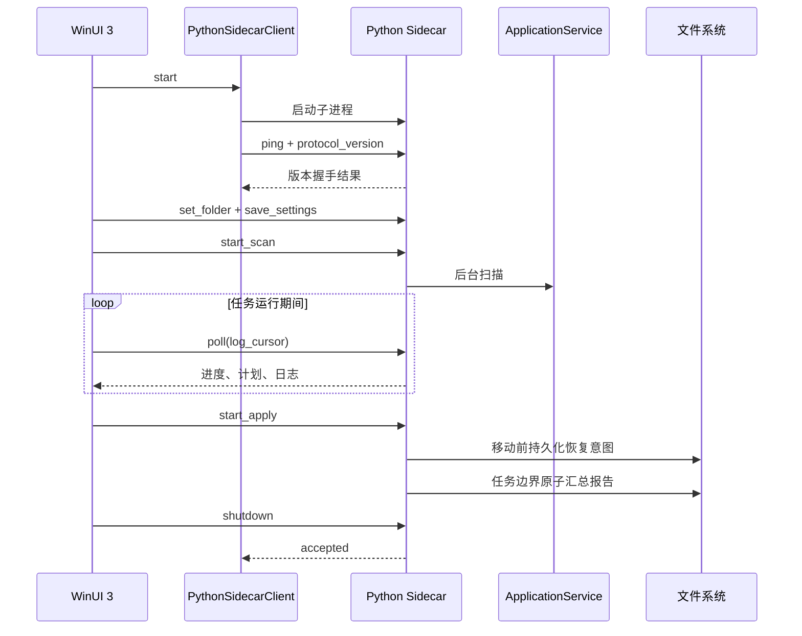

# WinUI 3 与 Python 架构说明

## 设计目标

LightNovelSelector 需要同时满足两件事：界面拥有真正的 Windows 原生质感，文件识别与整理逻辑继续使用成熟的 Python 实现。项目采用独立进程边界，而不是把 Python 解释器直接嵌入 C# 进程。



## 为什么采用 Sidecar

- Python 核心可以继续独立测试和命令行运行。
- C# 与 Python 崩溃边界清晰，错误可以转成结构化界面反馈。
- 不需要 Python.NET、COM 或进程内 GIL 管理。
- 发布时可把 Python 核心冻结成独立 EXE，用户无需安装 Python。
- 文件权限只掌握在 Python 核心，界面层无法绕过分类安全规则。

代价是需要维护一份稳定协议，并承担一次本地进程通信开销。对于扫描和文件移动任务，这部分开销远小于磁盘、哈希和网络查询耗时。

## 协议格式

传输编码为 UTF-8，每行一个完整 JSON 对象。

请求：

```json
{"id":12,"method":"set_folder","params":{"path":"D:\\Books"}}
```

成功响应：

```json
{"id":12,"ok":true,"result":{"folder":"D:\\Books"}}
```

失败响应：

```json
{"id":12,"ok":false,"error":{"type":"ValueError","message":"目录不存在"}}
```

约束：

- `id` 是正整数，同一连接内唯一。
- `method` 必须位于 Sidecar 白名单。
- 未识别方法、非法参数和 Python 异常都转换为错误对象。
- 单条请求上限为 1 MiB，超限行会被丢弃，后续合法请求仍可继续。
- 协议内容只写标准输出；标准错误保留最近诊断。
- C# 使用并发字典按 `id` 完成等待中的任务。
- 普通请求和启动握手都有超时，进程退出会使所有等待请求失败。

当前方法：

| 方法 | 作用 |
| --- | --- |
| `ping` | 返回应用版本和协议版本 |
| `bootstrap` | 获取设置、报告、任务和初始快照 |
| `poll` | 增量获取进度、计划、详情状态和日志 |
| `set_folder` | 更新当前目录并使旧预览失效 |
| `save_settings` | 保存偏好和自定义规则 |
| `start_scan` | 启动后台扫描 |
| `cancel_operation` | 请求取消当前可取消任务 |
| `edit_plan` | 手动修正单条分类计划 |
| `get_detail` | 获取封面、简介和目标详情 |
| `start_apply` | 启动文件整理 |
| `start_undo` | 按最近报告启动撤销 |
| `get_report` | 读取最近报告摘要 |
| `shutdown` | 优雅停止 Sidecar |

## 生命周期

1. WinUI 注册单实例键；重复启动把激活请求转交给现有窗口，不创建第二个 Sidecar。
2. WinUI 启动时优先查找应用目录中的 `LightNovelSelector.Sidecar.exe`。
3. 开发模式下向上查找仓库根目录，并按环境变量、`.venv-build`、`.venv`、系统 Python 顺序选择解释器。
4. Sidecar 启动后立即执行 `ping`，确认协议版本。
5. WinUI 定时 `poll`，但使用互斥标记避免轮询重入。
6. 启动、调用途中或两次轮询之间发现进程退出时，界面自动执行一次 `RestartAsync` 和 `bootstrap`。
7. 重启只恢复连接、持久化设置和最近报告；内存预览会明确清空，不自动重跑扫描、整理或撤销。
8. 自动恢复失败后停止轮询并进入 `Disconnected`，由用户通过错误栏手动重新连接，避免无限重启。
9. 页面卸载与启动、重启共用生命周期锁，关闭时不会与新进程创建发生竞态。
10. 正常退出先发送 `shutdown`；超时或管道损坏时终止整个进程树。
11. 文件移动或撤销运行中，窗口关闭事件会被取消并显示警告。

## UI 状态边界

Python 返回不可变快照，WinUI 只把快照映射为视觉状态：

- 任务状态决定按钮启用、取消入口、进度和关闭保护。
- 计划修订号变化时才重建列表，普通轮询不抖动选择状态。
- 预览使用主快照和可见快照分离；搜索输入短防抖后一次性替换可见数据源，执行整理始终作用于 Python 持有的完整计划。
- 日志使用递增游标去重，不重复追加同一记录。
- 详情请求使用取消令牌，快速切换选择不会让旧响应覆盖新选择。
- 目录或设置变化会使计划版本失效，执行前由 Python 再次验证。
- 活动报告使用 `ReportStats` 和 `ReportItem` 强类型模型，兼容缺少可选字段的旧报告。
- 连接状态固定为 `Connecting`、`Ready`、`Recovering`、`Disconnected`，统一控制徽标、错误栏和危险操作按钮。

## 连接恢复边界

`PythonSidecarClient.RestartAsync` 与启动、释放共用同一个生命周期锁。终止旧进程时先从当前进程引用中原子移除，再结束整个进程树；旧进程的退出监控只有在它仍是当前进程时才能使等待请求失败，因此不会误伤新进程请求。

恢复成功后必须重新 `bootstrap`。界面会清空旧计划、详情、日志游标和筛选结果，并提示重新扫描。分类报告保存在磁盘上，仍可在活动页打开；撤销需要核心恢复为 `Ready` 后才能执行。

## 报告恢复边界

整理开始时，Python 先以独占方式创建同目录的 `<报告名>.recovery.jsonl`，取得该报告的
执行权，再原子写入包含全部计划和唯一执行编号的基线报告。已有恢复日志会阻止新任务覆盖
上次现场。每次实际移动前只向恢复日志追加一条源路径和最终目标路径并 `fsync`；正常完成
时统一写最终报告并删除日志。因此 N 个文件只产生 O(N) 的日志写入和固定两次完整报告写入。

进程被强制结束后，读取报告或执行撤销会尝试合并同一执行编号的恢复日志。恢复必须同时满足：

- 报告、日志和记录路径都属于原分类根目录；
- 日志源路径存在于原报告，实际目标仍位于原计划的目标目录；
- 源文件已不存在，目标仍是未变化的普通文件；
- 同一日志中没有重复源路径或目标路径。

若移动尚未发生，表现为“源仍是普通文件且目标不存在”，该意图会安全忽略。源和目标同时存在、同时缺失、变成符号链接或目录、文件状态不匹配以及任何路径越界都会停止恢复并保留日志，等待人工检查。整理仍在当前进程中运行时，活动页只读取基线报告，不消费正在追加的日志。

## 窗口材质边界

- `MainWindow` 只创建一个窗口级系统背景，可在 Desktop Acrylic、Mica 和实色之间切换。
- `WindowAppearanceController` 是唯一允许替换 `SystemBackdrop` 的模块；页面和主题事件不能直接操作窗口背景。
- 主题变化只合并刷新标题栏颜色，系统背景会自行跟随主题，不在 `ActualThemeChanged` 回调中销毁重建。
- 导航栏与 Toast 可使用 In-App Acrylic；列表和重复卡片只使用半透明实色，不逐卡创建模糊层。
- 重复调用相同材质是幂等操作，避免 Windows App SDK 在主题资源解析期间重入原生背景生命周期。
- `UISettings.AdvancedEffectsEnabled` 关闭或高对比度启用时，有效材质临时切换为实色，但不覆盖用户选择。
- 系统事件不可订阅的未打包环境使用低频状态复核，避免影响窗口启动。
- 主题、材质和减少动态效果由 `AppearancePreferences` 统一读取，并使用 `%LOCALAPPDATA%` JSON 后备存储。

## 动效边界

动效由 `Helpers/Motion.cs` 统一实现：

- 进入、页面 reveal、Toast 和按压反馈使用 Windows Composition。
- 动画属性限制为 `Opacity`、`Scale` 和 `Translation`。
- 强 ease-out 曲线为 `(0.22, 1, 0.36, 1)`。
- 进入和退出方向一致，退出时长更短。
- `UISettings.AnimationsEnabled` 关闭时自动降级。
- 应用内 `ReducedMotion` 取消缩放和位移，只保留短透明度或控件颜色反馈。

## 发布边界

`build_winui.bat` 使用受路径保护的 PowerShell 流水线生成安装器：

1. PyInstaller 将 `lightnovel_sidecar.py` 冻结为单文件 Sidecar。
2. `dotnet publish` 以 `win-x64` 自包含方式发布 WinUI。
3. 项目文件把生成的 Sidecar 作为发布内容复制到 WinUI 目录根部。
4. 暂存发布目录执行真实启动与外观冒烟。
5. Inno Setup 把暂存目录封装为单个 `LightNovelSelector-v<版本>-win-x64-setup.exe`。
6. 只有以上步骤全部成功后才清理并替换 `dist\winui`；失败构建只留在可删除的 `build` 暂存区。

安装器解包后的应用体积较大，但不依赖目标机器已有 Python、.NET 或 Windows App SDK。Windows App SDK 的 `.mui` 语言目录都包含真实资源，安装器不创建空目录。`PublishTrimmed` 保持关闭，避免 XAML 和 JSON 反射元数据被错误裁剪；`PublishReadyToRun` 关闭，避免额外运行时包要求并控制体积。

## 故障定位

界面显示“分类核心不可用”时，按顺序检查：

1. 安装目录是否同时存在 `LightNovelSelector.exe` 和 `LightNovelSelector.Sidecar.exe`。
2. `ping` 是否返回 `protocol_version = 1`。
3. Sidecar 标准错误中的最近诊断。
4. 开发模式的 `LN_SELECTOR_PYTHON` 是否指向有效解释器。
5. 设置目录和目标目录是否可读写。

可单独验证冻结 Sidecar：

```powershell
'{"id":1,"method":"ping"}', '{"id":2,"method":"shutdown"}' |
  .\build\native-sidecar\LightNovelSelector.Sidecar.exe
```

任何协议格式变更都必须同步更新 Python 测试、C# 模型和 `SupportedProtocolVersion`。不兼容变更应提升协议版本，不能静默复用旧版本。
